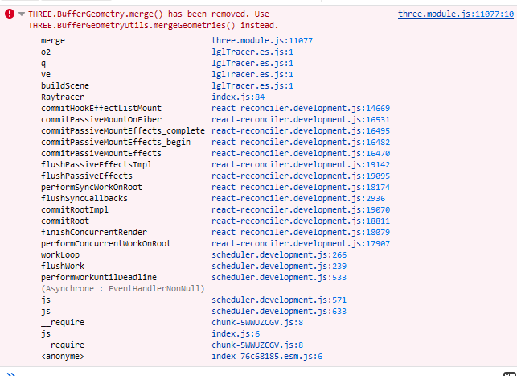

# r3f-vite-starter

A boilerplate to build R3F projects

```
yarn
yarn dev
```

# MeshPortalMaterial

https://github.com/pmndrs/drei/blob/7217da84ac0aca7bee89e695b1f799bfb5e01e04/src/core/MeshPortalMaterial.tsx#L84

# versions

    "@react-three/drei": "9.75.0",

    "@react-three/fiber": "8.13.3",

    "@react-three/lgl": "^0.0.4",

https://github.com/pmndrs/react-three-lgl?ref=reactjsexample.com

THREE.BufferGeometry.merge() has been removed. Use THREE.BufferGeometryUtils.mergeGeometries() instead.



App_lgl_codesandbox.jsx works with :

    "@react-three/drei": "8.7.4",

    "@react-three/fiber": "7.0.25",

    "@react-three/lgl": "0.0.4",

https://codesandbox.io/s/floating-diamonds-prb9t

# react get position & rotation informations from a mesh

```jsx
export const Experience2 = () => {
    const [meshInfos, setMeshInfos] = useState({
        size1: null,
        rotations1: null,
    });
return (
    <MonsterStage2>
        <A_ecrin_bas2 onMeshInfoUpdate={(meshInfos) => {
            console.log("A_ecrin_bas meshInfos : " + meshInfos.rotation1);
            setMeshInfos(meshInfos);
            }} />
    </MonsterStage2>
)}


const MonsterStage2 = ({meshInfos, ...props}) => {
      console.log("MonsterStage2 meshInfos.size1 : " +
      JSON.stringify(meshInfos.size1, null, 2)
  );
}

export function A_ecrin_bas2({onMeshInfoUpdate, ...props} ) {
    const meshRef1 = useRef();

    useEffect(() => {
        if (meshRef1.current && meshRef2.current) {
        meshRef1.current.geometry.computeBoundingBox();
        const size1 = meshRef1.current.geometry.boundingBox.getSize(new THREE.Vector3());
        const rotation1 = meshRef1.current.rotation;
        const scale1 = meshRef1.current.scale;

        onMeshInfoUpdate({
            size1,rotation1, scale1,
        });
        }
    }, []);

    return (
        <group {...props} dispose={null}>
         <mesh ref={meshRef1}
          geometry={nodes.faceBasse.geometry}
          material={materials.dia}
        />
```

# Diamond test 

https://codesandbox.io/s/zqrreo

Issue raised here : 

https://discourse.threejs.org/t/react-three-fiber-objects-missing-in-the-mobile-version/55078


# Exporting gltf

npx gltfjsx public/models/B_ecrin_bas.gltf -o "src/components/B_ecrin_bas.jsx" -r "public"
